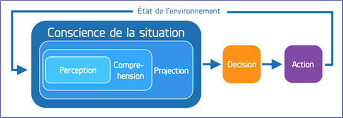
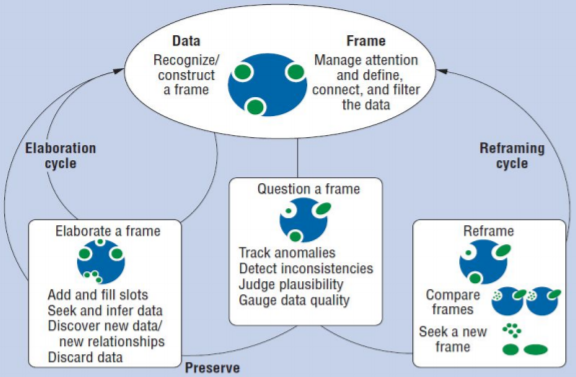

<strong><a href='../'>Home</a></strong>

<strong><a href='../../presentation/glossaire.html'>Version française</a></strong>

# Learning
* Learner - we prefer to use the term learner, as we do not prejudge whether the TBA is for students, high school students, college students, continuing education professionals, returnees, self-starters, etc.

# Dashboard
* Learning Analytics Dashboard (**fr.** *Tableau de bord d'apprentissage*) Learning analytics dashboards are graphical systems designed to support the exploratory or decision-making process of learning analysis. They incorporate graphical representation of indicators related to specific aspects of interest of learning. They also integrate interaction features that accompany to the user/analyst during the different phases of data exploration, situation investigation and even decision making. Moreover, dashboards must be adaptive and contextual to allow the users to compose on the fly relevant information and to generate appropriate displays at the appropriate moment in the course of the educational situation(s)".

* Indicator (**fr.** *Indicateur*) -  An indicator is a variable computed from observed (tracked, logged) data, possibly augmented with various other unobserved information (e.g. profile or context data), by means of transformation functions (e.g. abstraction, combination, synthesis, inference). Because the main purpose of indicators is to provide knowledge, we will more often speak of them is terms of *data*.
* Visualization (**fr.** *Visualisation*) - Visualizations are spatial displays of indicators in textual or graphical form. These representations are not just simple graphical components but result from a correspondence between an indicator and at least one appropriate graphical representation.
* Panel (**fr.** *Panneau*)
* Screen / Frame support (**fr.** *Ecran*) 
   * Panel versus Screen - panneau correspondant à un écran ou une partie d'écran

# Analyst's cognitive states and activities 
* **Awareness** : One of the best-known definitions for awareness is provided by [Dourish and Belloti (1992)](#Dourish1992): awareness is an understanding of the activities of others, which provides a context for your own activity. [Gutwin and Greenberg (1999)](#Gutwin1999) state that awareness:
  > * Is knowledge about a state of the work environment in a limited portion of time and space.
  > * Provides knowledge about changes in that environment.
  > * Is maintained by all the interactions between the team-mates and the environment.
  > * Is a part of an activity (completing a task, working on something). Maintaining awareness is not the purpose of an activity. Awareness is used to complete a task.

* **Situational awareness** is knowing what is happening in the environment and assessing its implications for the present and future. According to [Endsley 1995](#Endsley1995): 
  > Situational awareness is the perception of the elements of an environment in a volume of time and space, the understanding of their meaning and the projection of their state into the near future*.
  
  
    * Perception
    * Comprehension
    * Projection
* **Sensemaking** is the process of creating situational awareness and understanding to support decision making (Klein et al., 2007)
* **Data Frames** - conceptual frame of reference - cognitive schema. According to Klein, the purpose of the frame is to 
1. define the elements of the situation 
2. describe the importance of these elements, 
3. describe the relationships between these elements
4. filter out irrelevant messages while highlighting relevant ones, and 
5. reflect the context of the situation, not just the data. 
* **Data** - (in the context of *Sensemaking*) 
* **Frame of Reference**
* **Cycle (activities) of Sensemaking** - 

# Design
* Participatory Design
* Design space: "the universe of all possible design choices"

# References
(http://edutechwiki.unige.ch/en/Awareness)
 
* <a name="Dourish1992"/> Dourish, P. & Bellotti. V. (1992). Awareness and coordination in shared workspaces. In J. Turner & R. Kraut (Eds.), Proceedings of ACM CSCW'92 Conference on Computer Supported Cooperative Work, 107-114, Toronto, Canada.
* <a name="Endsley1995"/> Endsley, M. R. (1995). Measurement of situation awareness in dynamic systems. Human factors, 37(1), 65-84.
* <a name="Gutwin1999"/>Gutwin, C. & Greenberg, S. (1999). A framework of awareness for small groups in shared workspace groupware. (Technical Report 99-1), Department of Computer Science, University of Saskatchewan, Canada.