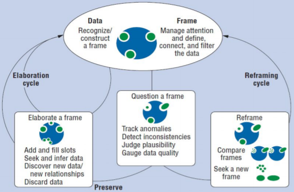

<strong><a href='../'>Accueil</a></strong>

<strong><a href='../en/presentation/glossaire.html'>English version</a></strong>

# Apprentissage humain
* Apprentissage - selon le Cedefop (*Centre Européen pour le développement de la formation professionnelle*), l'apprentissage est le processus dans lequel un individu assimile de l’information, des idées et des valeurs et acquiert ainsi des savoirs, savoirfaire, aptitudes et/ou compétences. L’apprentissage s’effectue par la réflexion personnelle, la reconstruction ainsi que l’interaction sociale. l’apprentissage peut se dérouler dans un contexte formel, non formel ou informel.
* Apprenant - Un apprenant est typiquement une personne engagée dans un processus d'apprentissage. Nous ne préjugeons pas si le TBA concerne des élèves, des collégiens, des lycéens, des étudiants, des professionnels en formation continue, des personnes en reconversion, des autodidactes ... Par conséquent, nous utilisons de préférence le terme apprenant à celui d'élève puisque ce dernier décrit avant tout une personne inscrite dans une école ou un autre établissement d'enseignement. En effet, les apprenants peuvent apprendre sans enseignants, les élèves ne sont élèves à proprement parler que quand ils disposent d'enseignants.

# Analytique et Tableaux de bord
* Indicateur (**en.** *Indicator*) - Un indicateur est une variable calculée moyennant des fonctions de transformation (par exemple d'abstraction, de combinaison, de synthèse, d'inférence), à partir de données observées. Les données observées peuvent éventuellement être augmentées avec diverses autres informations non observées (par exemple, des données de profil ou du contexte). Parce que ce les indicateurs ont pour principales missions de fournir une connaissance, nous parlerons plus spntanément de données.
* Visualisation (**en.** *Visualization*) - Les visualisations sont des représentations spatiales d'indicateurs sous forme visuelle (textuelle ou graphique). Elles sont conçues pour transformer les données en connaissances exploitables qui peuvent être facilement perçues et interprétées.
* Tableau de bord d'apprentissage (**en.** *Learning Analytics Dashboard*): Les tableaux de bords d'apprentissage sont des dispositifs de soutien au processus exploratoire ou décisionnel d'analyse de l'apprentissage par la représentation graphique d'indicateurs relatifs à des aspects particuliers de cet apprentissage. Ces dispositifs offrent des moyens d'interactions qui accompagnent l'utilisateur/analyste durant les différentes phases d'exploration, d'investigation voire de décision. "Les tableaux de bords doivent être adaptatifs et contextuels. Il s’agit de composer à la volée des regroupements d’informations pertinentes et de générer ces tableaux de bord au moment adéquat dans le déroulement de la (ou des) situation(s) pédagogique(s)".
* Panneau (**en.** *Panel*) - En fonction de son type et de sa nature, il est possible d'associer à un indicateur plusieurs types de visualisations. Néanmoins, dans un contexte donné et pour un besoin analytique spécifique, toutes les représentations possibles ne sont pas toujours pertinentes. En effet, un ensemble limité de possibilités permettrait de mieux identifier les propriétés visées par l'analyste. Nous définissons le concept de panneau comme étant l'unité élémentaire de construction d'un tableau de bord d'apprentissage. Il permet d'associer un type de visualisation jugé pertinent pour un besoin analytique spécifique à un indicateur en particulier. 
* Ecran (**en.** *Screen / Frame support*) 
   * Pannel versus Screen - panneau correspondant à un écran ou une partie d'écran

# Actvités et états cognitifs associés à l'analytique
* **Conscience de la situation** (en. Situational awareness) consiste à connaître ce qui se passe dans l'environnement et à évaluer ses implications pour le présent et l'avenir (Endsley, 1995)
  * *La conscience de la situation est la perception des éléments d’un environnement dans un volume de temps et d’espace, la compréhension de leur signification et la projection de leur état dans un futur proche*
  

  * Perception
     * Comprehension
     * Projection
* **La construction du sens (Sensemaking)** Selon Klein et al.(2007), le sensemking est le processus de création d'une conscience et d'une compréhension de la situation pour soutenir la prise de décision. Visant à interpréter et comprendre les événement, cet effort délibéré est habituellement déclenché par des changements souvent inattendus nous conduisent à remettre en cause la compréhension précédente. 
Par conséquent, il vise à « remettre de l’ordre » dans sa compréhension, à structurer des données disparates, incertaines, incohérentes voire contradictoires, quitte à exclure des informations disponibles du champ d’attention ou à en introduire de nouvelles. Selon (Weick, 1995), l'objectif n’est alors pas l’exactitude de la compréhension, généralement inaccessible, mais sa plausibilité et sa cohérence.
* **Data Frames** - cadre conceptuel de réference - schéma cognitif. Selon Klein, le but du frame est de 
1. définir les éléments de la situation, 
2. décrire l'importance de ces éléments, 
3. décrire les relations existant entre ces éléments
4. filtrer les messages non pertinents tout en mettant en évidence les messages pertinents, et 
5. refléter le contexte de la situation, et pas seulement les données. 
* **Données** - (dans le contexte *Sensemaking*) 
* **Schéma cognitif ou Cadre explicatif (frame)** - (dans le contexte *Sensemaking*) 
* **Frame of Reference** 
* **Cycle (activités) de Sensemaking** - 

# Conception de tableaux de bord
* Conception participative
* Espace de conception : “l'univers de tous les choix de conception possibles”

